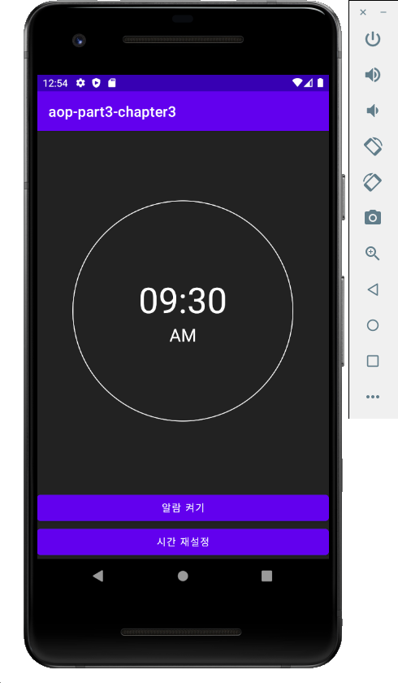

# aop-part3-chapter03 -  알람앱

# 목차

1. 인트로 (완성앱 & 구현 기능 소개)
2. 레이아웃 작성하기
3. 알람 설정 화면 구현하기
4. AlarmManager 을 사용하여 알람 등록하기
5. AlarmReceiver 구현하기
6. 아웃트로

# 결과화면

# 이 챕터를 통해 배우는 것

 

- **AlarmManager** 사용하기
- **Notification** 사용하기 (파트3, 챕터1 복습)
- **Broadcast receiver** 사용하기

### Background 작업

- Immediate tasks (즉시 실행해야하는 작업)
  - Thread
  - Handler
  - Kotlin coroutines

- Deferred tasks (지연된 작업)
  - WorkManager
- Exact tasks (정시에 실행해야 하는 작업)
  - AlarmManager

### AlarmManager

- Real Time (실제 시간) 으로 실행시키는 방법
- Elapsed Time (기기가 부팅된지부터 얼마나 지났는지) 으로 실행시키는 방법

### 알람앱

지정된 시간에 알람이 울리게 할 수 있음.

지정된 시간 이후에는 매일 같은 시간에 반복되게 알람이 울리게 할 수 있음.

